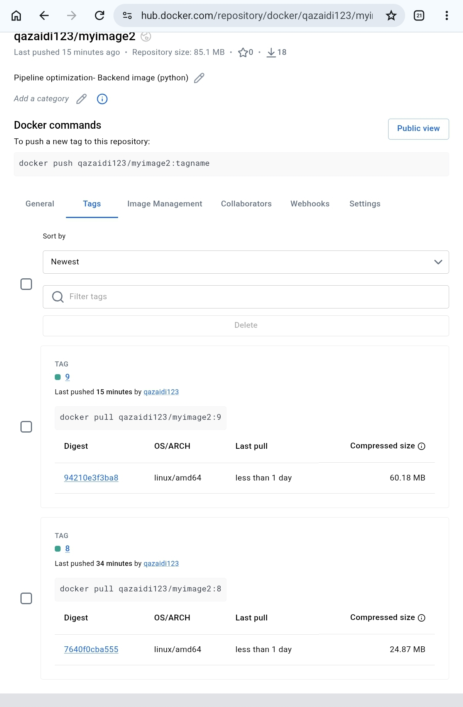
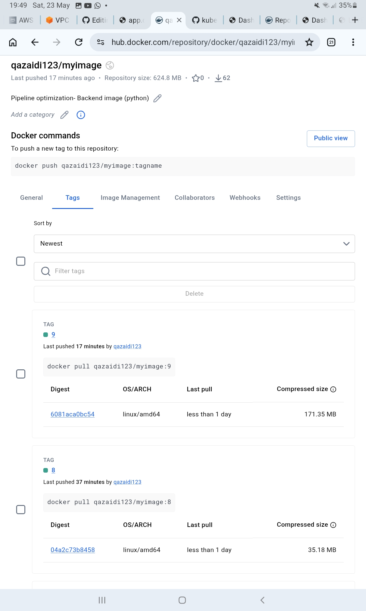
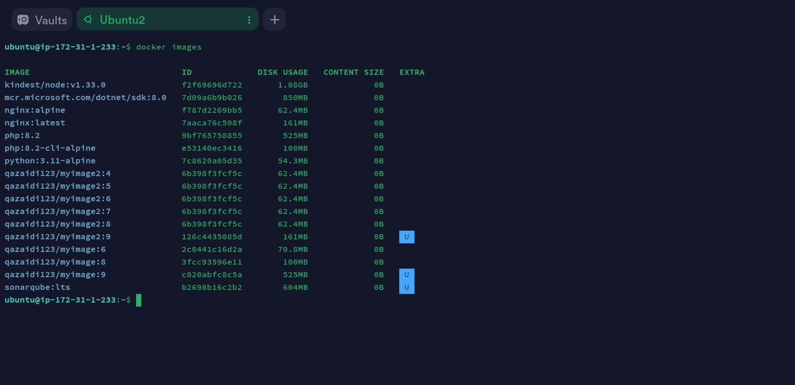
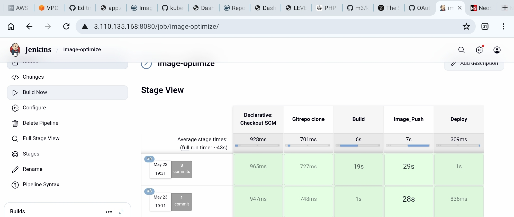
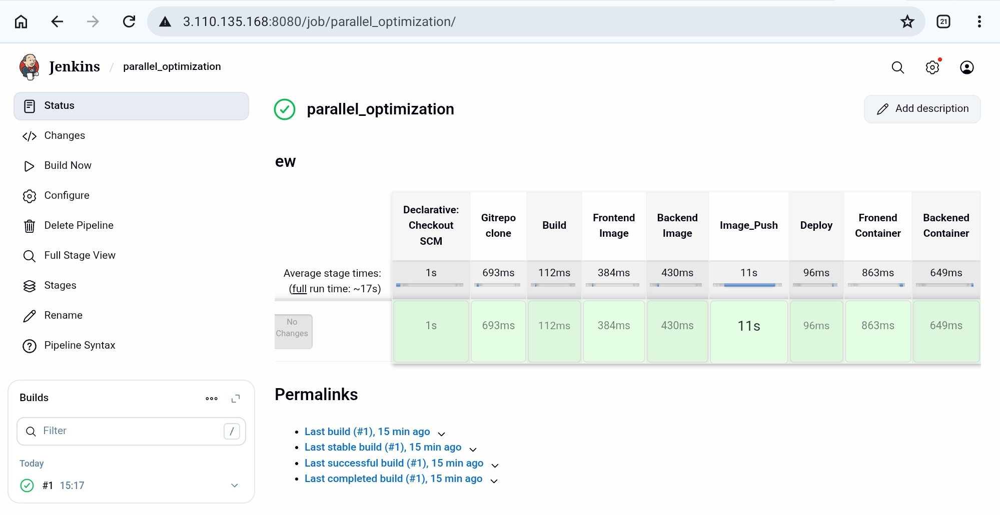

This GitRepo reflects the Jenkinspipeline optimization by - (1) Alpine images (2) Parellel run of independent stages

# (1) By Alpine Images

# Frontend Dockerfile with nginx:alpine (Image name: qazaidi123/frontimage:1) 
Total Image size: 24.83 MB , 

Image layer size : 3.69 MB  (First Layer: ADD alpine-minirootfs-3.23.4-x86_64.tar.gz / # buildkit) , 

Disk usage in EC2: 62.3 MB

# Backend Dockerfile with php:8.2-cli-alpine (Image name: qazaidi123/backimage:1) 
Total Image size: 35.18 MB ,   

Image layer size : 3.69 MB  (First Layer: ADD alpine-minirootfs-3.23.4-x86_64.tar.gz / # buildkit) , 

Disk usage in EC2: 100 MB

# Frontend Dockerfile without alpine --> nginx:latest (Image name: qazaidi123/frontimage:2) 
Total Image size: 60.18 MB , 

Image layer size : 28.4 MB  (First Layer: debian.sh --arch 'amd64' out/) , 

Disk usage in EC2: 161 MB

# Backend Dockerfile without apine --> php:8.2  (Image name: qazaidi123/backimage:2) 
Total Image size: 171.35 MB ,     

Image layer size : 28.4 MB  (First Layer: debian.sh --arch 'amd64' out/) , 

Disk usage in EC2: 525 MB

# Jenkins pipeline stage time consumption
Image build stage from Dockerfile with alpine images:    857ms , 

Image build stage from Dockerfile without alpine images: 20s , 

Total Time consumption by pipeline with alpine image: 23s , 

Total Time consumption by pipeline without alpine image: 39s , 

Here the diffrence in time is not too much because the GitRepo, Dockerfiles and Jenkinsfile is kept simple
and is for learning purpose, but in real projects the alpine images may have big diffrence in time consumption of pipeline run.

# (2) By Parellalization (Very Effective):
Jenkins Pipeline optimization is also done by parellel run of independent stages. For e.g in Jenkinsfile Image build stage, frondend and backend image build is sequential i.e once the frontend image build is completed then only the backend build will start. Similary in Container run (Deploy), backend container run will start after the frontend container will be completed.
But in parellal run (jenkinsfile), frontend and backend image build will run parellal, similalry container run of both will also processed parellel. Therefore pipeline will take less time to complete.

Time taken by pipeline (Jenkinsfile) without parellel run:39s , 

Time taken by pipeline (jenkinsfile) with parellel run: 17s

# Screenshots: 
## Pipeline optimization by using Alpine image

## Image size-DockerHUb
Backened Image

Frontend Image

# (2) Diskspace by images on EC2

# (3) Pipeline with and without Alpine images

#  Parellalization Optimization

