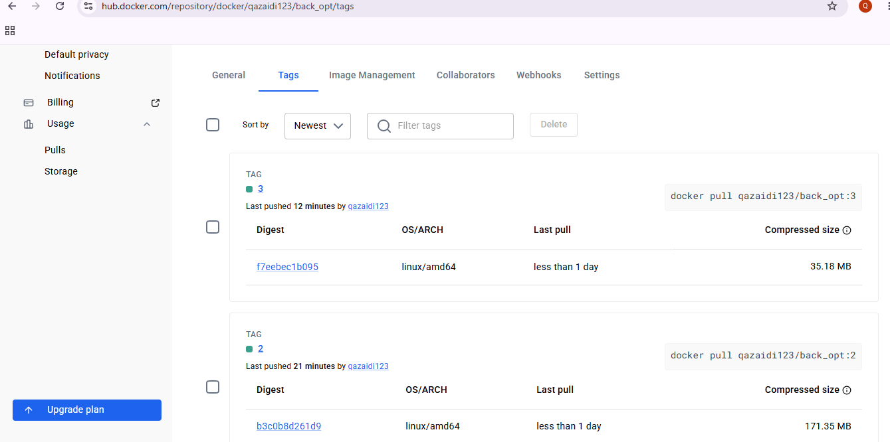
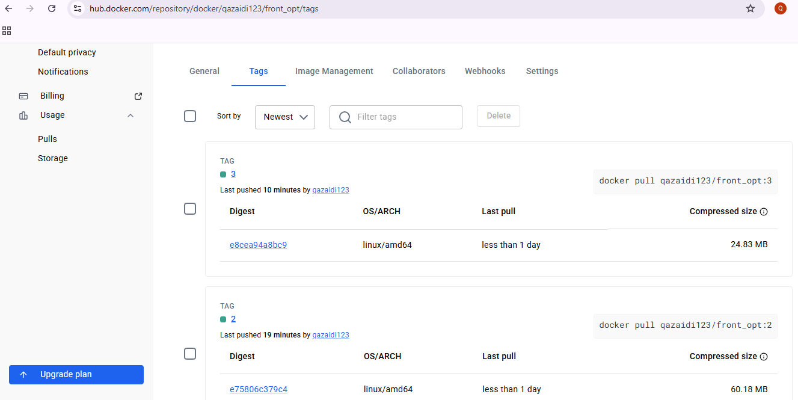
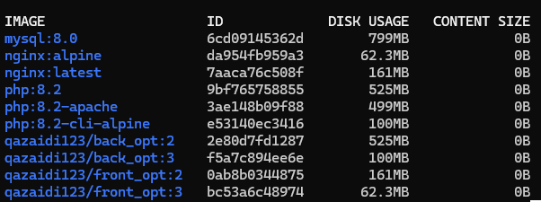
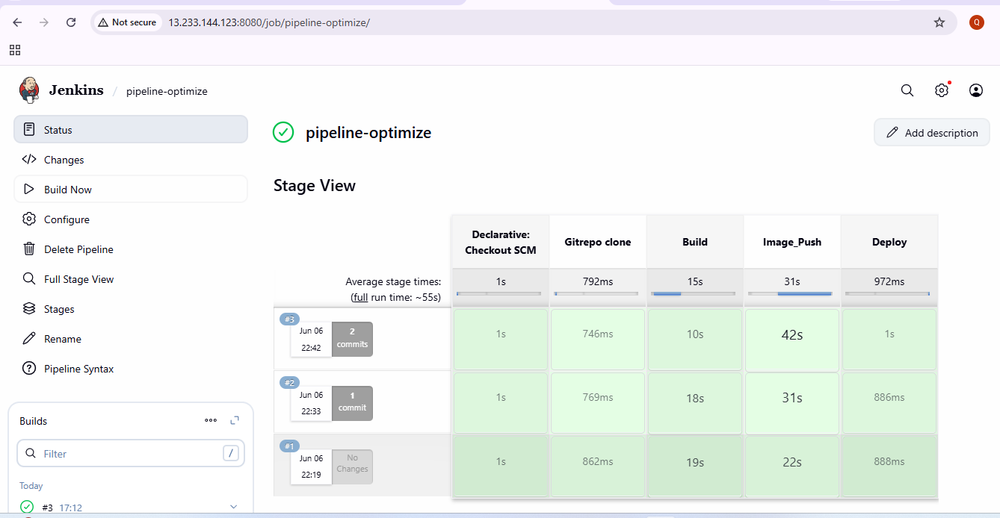
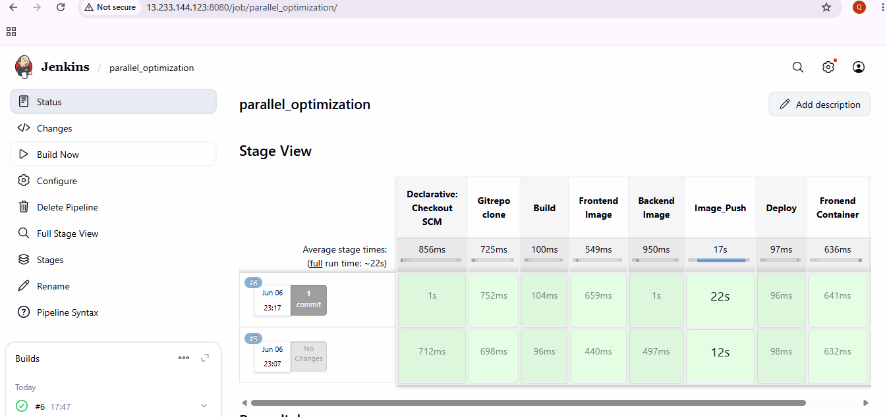

# "This repository demonstrates Jenkins pipeline optimization techniques using Alpine-based Docker images and parallel execution of independent stages.”

The goal is to reduce:
- Docker image size
  
- Pipeline execution time
  
- EC2 disk usage

  # Tech Stack
- Jenkins
- Docker
- DockerHub
- Nginx
- PHP
- AWS EC2
- GitHub

# (1) Optimization - Alpine Images

# Frontend Dockerfile with nginx:alpine (Image name: qazaidi123/frontimage:1) 
- Total Image size: 24.83 MB , 
- Image layer size : 3.69 MB  (First Layer: ADD alpine-minirootfs-3.23.4-x86_64.tar.gz / # buildkit) , 
- Disk usage in EC2: 62.3 MB

# Backend Dockerfile with php:8.2-cli-alpine (Image name: qazaidi123/backimage:1) 
- Total Image size: 35.18 MB ,   
- Image layer size : 3.69 MB  (First Layer: ADD alpine-minirootfs-3.23.4-x86_64.tar.gz / # buildkit) , 
- Disk usage in EC2: 100 MB

# Frontend Dockerfile without alpine --> nginx:latest (Image name: qazaidi123/frontimage:2) 
- Total Image size: 60.18 MB , 
- Image layer size : 28.4 MB  (First Layer: debian.sh --arch 'amd64' out/) , 
- Disk usage in EC2: 161 MB

# Backend Dockerfile without apine --> php:8.2  (Image name: qazaidi123/backimage:12) 
- Total Image size: 171.35 MB ,     
- Image layer size : 28.4 MB  (First Layer: debian.sh --arch 'amd64' out/) , 
- Disk usage in EC2: 525 MB

# Pipeline run-time comparison
- Image build stage from Dockerfile with alpine images:    857ms , 
- Image build stage from Dockerfile without alpine images: 20s , 
- Total Time consumption by pipeline with alpine image: 23s , 
- Total Time consumption by pipeline without alpine image: 39s , 

Note:

Since the application is intentionally lightweight for learning purposes, the runtime difference is moderate. In large-scale production projects, Alpine images can significantly reduce pipeline execution time and storage usage.

# (2) By Parellalization i.e Parellal jenkins stages (Very Effective):
Jenkins Pipeline optimization is also done by parellel run of independent stages. 
- Sequential run (Jenkinsfile): Frontend and Backend images build runs one after the another i.e once the frontend image build is completed then only the backend build will start. Similary in Container run (Deploy), backend container run will start after the frontend container will be completed.
- Parellal run (jenkinsfile): Frontend and backend image build will run simultaneously using parallel stages. Similalry container run of both images will also processed simultanously. Therefore pipeline will take less time to complete.

## Parelllalization results:

- Sequential mode :39s , 

- Parellel run: 17s

# Jenkins Pipeline Features
- GitHub integration
- Automated Docker image build
- Parallel frontend/backend image builds
- DockerHub image push
- Automated container deployment
- CI/CD runtime optimization

# Key Learnings
- Alpine images reduce Docker image size and storage consumption.
- Smaller images improve pipeline efficiency.
- Parallel Jenkins stages significantly reduce pipeline runtime.
- CI/CD optimization improves scalability and deployment efficiency.

# Screenshots: 

DockerHub-Backend

DockerHub-Frontend

Diskspace usage by Images- Alpine vs normal Images

 Pipeline time consumptiom with and without Alpine images
 

Parallelization Pipeline time

